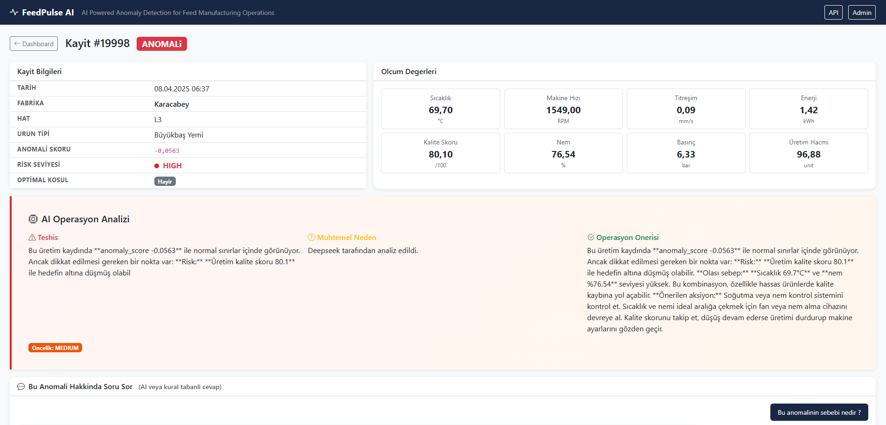
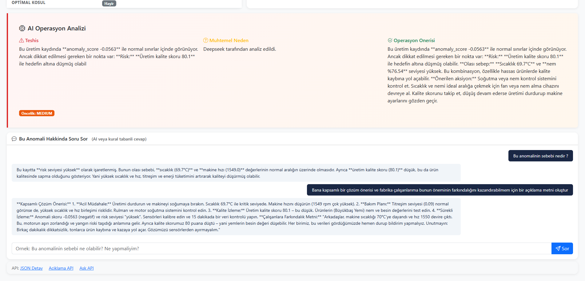

# FeedPulse AI
### AI Powered Anomaly Detection for Feed Manufacturing Operations

[](https://github.com/Ilhanemreadak/FeedPulse-AI/actions/workflows/ci.yml)

---

## 1. Problem

Üretim hatlarında sıcaklık, titreşim, enerji tüketimi ve kalite gibi operasyonel parametreler sürekli değişir. Bu değişimlerin bir kısmı normal üretim varyasyonu, bir kısmı ise makine arızası, hammadde kalitesi veya süreç sapması gibi gerçek sorunların işaretidir. Sorun şu: geleneksel eşik tabanlı sistemler yalnızca önceden tanımlanmış hata tiplerini yakalar. Yeni anomali tipleri veya çok parametreli sapmalar gözden kaçar.

**FeedPulse AI**, normal üretim davranışını öğrenerek bu davranıştan sapan kayıtları tespit eder ve operasyon ekibine insan dilinde açıklama ve öneri sunar.

---

## 2. Neden Yem / Gıda / Tarım Şirketlerine Uygun?

- **Erken uyarı:** Makine arızası öncesinde anormal titreşim veya sıcaklık artışını yakalamak, plansız duruşları önler.
- **Kalite güvencesi:** Üretim kalite skorundaki düşüşler anlık tespit edilir, fire minimize edilir.
- **Enerji verimliliği:** Enerji tüketimi/üretim hacmi oranındaki sapmalar maliyet israfını gösterir.
- **Çok fabrika yönetimi:** Farklı lokasyonları tek dashboard'dan izleme.
- **Etiket gerektirmez:** Gerçek üretimde tüm hata tipleri önceden etiketlenemez; IsolationForest bu sorunu çözer.

---

## 3. Veri Seti

**Birincil kaynak:** Kaggle — `programmer3/smart-manufacturing-process-data`

```bash
kaggle datasets download -d programmer3/smart-manufacturing-process-data
python manage.py import_dataset data/DATASET_FILE.csv
```

**Alternatif (sentetik):**
```bash
python manage.py generate_synthetic_dataset --rows 1500 --output data/feedpulse_synthetic_dataset.csv
python manage.py import_dataset data/feedpulse_synthetic_dataset.csv
```

**Mevcut:** `data/Manufacturing_dataset.csv` (10.000 satır)

Kolon eşleştirmesi import sırasında otomatik yapılır. Eksik kolonlar sentetik olarak üretilir.

---

## 4. Teknoloji Yığını

| Katman | Teknoloji |
|--------|-----------|
| Backend | Python 3.x, Django 4.x |
| REST API | Django Rest Framework |
| Veritabanı | SQLite |
| Veri İşleme | Pandas, NumPy |
| ML | Scikit-learn (IsolationForest, StandardScaler) |
| Model Serializasyon | Joblib |
| Frontend | Django Templates, Bootstrap 5, Chart.js |
| LLM (opsiyonel) | LangChain (OpenAI / Anthropic / Groq / Gemini / DeepSeek) |
| Test & Kalite | pytest, ruff, pre-commit, GitHub Actions CI |
| Config | python-dotenv |

---

## 5. Mimari

```
HTTP Request
    |
    v
Django Views (operations/views.py)
    |
    +-- Dashboard View ---------> dashboard.html (Bootstrap 5 + Chart.js)
    +-- Record Detail View -----> record_detail.html
    |
    +-- REST API (DRF)
            |
            +-- /api/summary/
            +-- /api/records/
            +-- /api/anomalies/
            +-- /api/explain/<id>/  --> explanation_service.py
            +-- /api/predict/       --> anomaly_service.py
                                          |
                                    IsolationForest (ml_models/)

Management Commands:
  import_dataset -------> data_mapping_service.py --> ProductionRecord DB
  train_anomaly_model --> anomaly_service.py -------> ml_models/*.joblib
  generate_synthetic_dataset -----------------------> data/csv
```

---

## 6. ML Yaklaşımı

1. `import_dataset` ile CSV verisi `ProductionRecord` tablosuna yüklenir.
2. `train_anomaly_model` komutu:
   - 8 numerik feature seçer
   - Eksik değerleri medyan ile doldurur
   - `StandardScaler` ile normalize eder
   - `IsolationForest` eğitir (n_estimators=200, contamination=0.08)
   - Her kayıt için `predicted_anomaly`, `anomaly_score`, `risk_level` alanlarını DB'ye yazar

---

## 7. Neden IsolationForest?

| Kriter | IsolationForest | Supervised (RF, XGBoost) |
|--------|-----------------|--------------------------|
| Etiket gereksinimi | Yok | Gerekli |
| Yeni anomali tipleri | Yakalar | Etiketlenmediyse yakamaz |
| Üretim gerçekliği uyumu | Yüksek | Düşük |

IsolationForest, normal örnekleri zor izole eder, anomalileri kolay izole eder. Bu prensip üretim sensör verisi için idealdir.

---

## 8. Kurulum ve Çalıştırma

```bash
# Ortam kur
python -m venv venv
venv\Scripts\activate          # Windows
# source venv/bin/activate     # macOS/Linux

# Bagimliliklar
pip install -r requirements.txt

# Veritabani
python manage.py migrate

# Veri yukle
python manage.py import_dataset data/Manufacturing_dataset.csv

# Model egit
python manage.py train_anomaly_model

# Sunucuyu baslat
python manage.py runserver
```

Tarayıcıda: http://localhost:8000

Admin: http://localhost:8000/admin/
```bash
python manage.py createsuperuser
```

**Opsiyonel LLM:**
```bash
cp .env.example .env
# .env dosyasına OPENAI_API_KEY ekle
```

---

## 8b. Docker ile Çalıştırma

En kolay yol — tek komutla migrate + veri import + model eğitimi + sunucu.

**Build:**
```bash
docker compose build
```

**Çalıştır:**
```bash
docker compose up
```

**Arka planda:**
```bash
docker compose up -d
```

**Log izleme:**
```bash
docker compose logs -f
```

**Durdurma:**
```bash
docker compose down
```

**Uygulama:** http://localhost:8000
**Admin:** http://localhost:8000/admin/

> **Not:** İlk açılışta container otomatik olarak migrate, collectstatic,
> dataset import ve model training işlemlerini yapar. Model eğitimi nedeniyle
> ilk açılış birkaç dakika sürebilir. Sonraki açılışlarda veri ve model zaten
> mevcut olduğundan hızlı başlar (idempotent entrypoint).

**Windows (Docker Desktop):** Komutlar aynı. PowerShell veya CMD'de çalışır.
Docker Desktop açık olmalı.

---

## 8c. Geliştirme & Test

Geliştirme araçları (pytest, ruff, pre-commit) `requirements-dev.txt` içindedir.

```bash
# Runtime + geliştirme bağımlılıkları
pip install -r requirements.txt -r requirements-dev.txt

# Testler (pytest + pytest-django)
pytest

# Lint + format (ruff)
ruff check .
ruff format .

# Commit öncesi otomatik kontrol (opsiyonel)
pre-commit install
```

- **Testler:** `operations/tests/` — servis mantığı (anomaly, mapping, açıklama) ve
  API kontratları kapsanır. LLM çağrıları mock'lanır, ağ erişimi gerekmez.
- **CI:** Her push/PR'da GitHub Actions ruff lint/format + pytest çalıştırır
  (`.github/workflows/ci.yml`).
- **Config:** Araç ayarları `pyproject.toml` içinde merkezîdir.

---

## 9. API Endpointleri

| Method | URL | Açıklama |
|--------|-----|----------|
| GET | `/dashboard/` | Ana dashboard (HTML) |
| GET | `/records/<id>/` | Kayıt detayı (HTML) |
| GET | `/api/summary/` | Özet istatistikler |
| GET | `/api/records/` | Tüm kayıtlar (sayfalı, `?page=N`) |
| GET | `/api/anomalies/` | Anomali kayıtları (sayfalı, `?page=N`) |
| GET | `/api/records/<id>/` | Tek kayıt detayı |
| GET | `/api/explain/<id>/` | Anomali açıklaması (LLM / kural tabanlı) |
| POST | `/api/ask/<id>/` | Kayıt hakkında serbest soru-cevap |
| POST | `/api/predict/` | Yeni veri için tahmin |

**POST /api/predict/ örnek:**
```json
{
  "temperature": 92.5,
  "machine_speed": 950,
  "vibration_level": 8.7,
  "energy_consumption": 78.2,
  "production_quality_score": 71.0,
  "humidity": 65,
  "pressure": 4.1,
  "production_volume": 48
}
```

---

## 10. Dashboard Ekranları

- 6 KPI kartı: toplam kayıt, anomali sayısı, oran, kalite, enerji, en riskli fabrika
- Fabrikaya göre anomali bar chart
- Risk dağılımı donut chart
- Ürün tipi kalite ortalaması horizontal bar chart
- Anomali trendi line chart (son 30 gün)
- Son 50 kayıt tablosu (anomaliler kırmızıyla vurgulanır)
- Kayıt detay sayfası: sensör değerleri + AI açıklama kutusu + soru-cevap chat

### Ekran Görüntüleri

**Anomali Detay Sayfası**



**AI ile Soru-Cevap**



---

## 11. Geliştirme Fırsatları

- **Real-time:** Celery + Redis ile streaming anomali tespiti
- **Alerting:** E-posta / SMS bildirimleri
- **AutoML:** Contamination parametresini otomatik tuning
- **Multi-model:** Fabrika veya ürün tipine göre ayrı model stratejisi
- **Feature engineering:** Lag features, rolling ortalamalar
- **Deployment:** Nginx reverse proxy + managed Postgres (Docker/Gunicorn mevcut)
- **Auth:** Fabrika bazlı kullanıcı yetkilendirmesi
